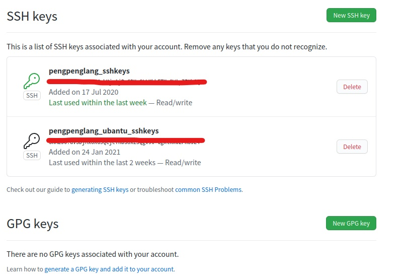
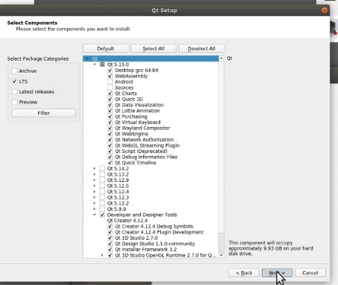
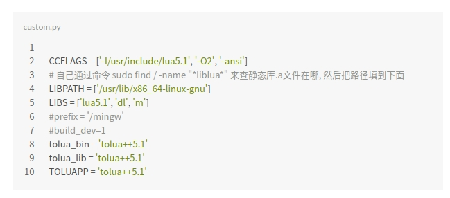

# 食用说明

👋 Hello，这里是 19 级全体成员为 CUGB 足球机器人队倾尽汗水与智慧荣誉出品的避坑手册。由于官方安装视频众多且新旧不一、安装过程中报错时缺少详细的解决办法，仅仅看官方教程很难成功安装并运行 `rocos`，因此诞生了本手册帮助安装的人指明一条正确的安装道路、提供我们遇到报错时解决的方法，旨在帮助后人避免无意义的踩坑，快速的上手进行足球机器人项目开发。

## 环境要求

> 进行 `rocos` 的安装需要确保已经满足以下条件 👇🏻

- 电脑已经安装 `ubantu18.04` 及以上版本且成功联网，安装最好是双系统形式
- 掌握基本的 `linux` 指令知识并熟悉 `ubantu` 系统操作使用
- 加入学习通机器人队课程（需要用到官方的安装教程）
- 建议拥有一个翻墙的梯子（因为好多下载源都是国外网站，可能下载会很慢或者被墙掉），这里给出两个免费用起来还不错的翻墙方法
  - 一种是支持 chronium 内核的浏览器（火狐、谷歌、edge、chrome）在商店下载一个 `setup-vpn ` 扩展，注册账号后多个免费节点使用
  - 另一种是下载[蓝灯vpn](https://gitee.com/kevin402502/lantern?_from=gitee_search)，每个月 500M 高速流量与无线免费流量

## 安装流程

安装有两套官方教程，经实践参考任一一套流程均可能成功，安装每个步骤同时遇到问题可以查看本手册是否有相应的解决办法。

* 第一套流程：[浙大mark老师从0开始安装视频](https://www.bilibili.com/video/BV1wf4y1d7gU?from=search&seid=10642082262191691347)，首推该方法对照视频大概半小时即可完成安装
* 第二套流程：[官方人员分三节的安装视频](https://space.bilibili.com/298653126/video)，B站官方账号的 ChinaOpenSSL 系列专题直播公开课前三节（课程内也有这三节课的链接），视频较长但是比较详细 pengpenglang 是参考该方法安装成功的

需要说明的是具体如何安装需要大家自己对照着视频耐心仔细的操作，本手册在某些步骤给出了提醒和额外说明，推荐先看下手册是否对官方视频有改正声明再进行操作。

## 常用操作介绍

- linux 不同于 windows 的图形界面，程序员们为了更高效工作大多是使用系统特有的终端进行指令输入控制的，打开的终端方法有两种
  - 一种是快捷键 <kbd>ctrl</kbd>+<kbd>alt</kbd>+<kbd>T</kbd> 打开处于主目录下的终端
  - 一种是在指定文件位置右键选择菜单下的 `在终端打开` 选项打开处于当前位置下的终端
- 在终端查看当前文件位置下的所有文件使用指令 `ll` 或者 `ls`
- 在终端进入到其他文件位置使用指令 `cd XXX/XXX`
- 运行当前文件位置下的某个可执行文件借助指令 `./XXX.文件名后缀`
- 执行指令经常遇到权限不够（比如 `ubantu` 的所有图形化界面操作、修改或者移动系统文件下的文件），在输入指令前面加上关键字 `sudo` 后即相当于以管理员权限指令，回车后需要输入管理员账户密码
- 在创建新的或者打开已有 `.txt` 文件使用指令 [gedit](https://www.dotcpp.com/course/352)
- 需要下载某个应用或者可执行文件
  - 一种方法是在 `ubantu软件` 官方应用安装市场中获取，一般想要安装的应用都找不到（建议使用下面的方法）
  - 另一种方法打开浏览器输入应用官方安装链接下载 linux 支持的安装文件（比如 `.deb` 或者 `.rpm` 后缀结尾)
- 输入指令时可以借助 <kbd>Tab</kbd> 进行自动补全指令

## 系统特性

- linux 和 git 的指令执行都有一个特性：无事就是好事，即如果指令执行完要么是直接等待执行下一个指令，要么就是指令执行过程中出现的提醒或者报错
- linux 是开源系统没有唯一的官方下载地址，一般都是由第三方社区、大型互联网公司或科研高效、机构自行维护一套完整的下载源，所以系统默认的更新地址、应用下载一般都是存在许多镜像源的，有的下载慢有的下载快
- 系统缺点是图形界面少，更多的是通多指令进行操作，但同时你的操作权限也更大甚至一个指令删除整个系统都可以做到，平常注意自己的文件放置的位置以及执行的指令，很可能你的粗心导致了系统内存占满崩溃或者删库行为的发生
- 执行指令就相当于系绳子，有系绳子的方法就有解绳子的方法，出现错误一定要有解决办法，关键看你能否找到而不是凭感觉操作

# 正式安装配置 rocos

BB 了辣么多有的没的就是为了大家在下面安装过程中不要懵逼，学长们已经帮你们解决了一部分问题，如果出现没遇到过的错误可以去网上查找解决办法，推荐先去 stackoverflow、bing  查看相关问题解决办法，没有然后再去 CSDN、百度，因为后者虽然方便但是好多办法由于年代久远可能已经失效，最好先看下帖子的日期再决定是否尝试

## git 远程仓库的使用

**配置官方文档文件夹下第一期文档有详细的介绍**

> 个人最大的感受就是 `ubantu` 想要发挥高效操作的作用就需要熟练掌握终端指令的使用，而 `github` 不仅恰恰是使用指令可以帮助我们习惯这种操作并且以后大家多人协作可能也有用到

* 账号应该每个人之前注册过了，就参照文档里的操作就好
* 安装打开终端用 `apt-get` 指令，这是 `ubantu` 安装应用的第一种方式也是最简单的，它相当于直接从官方源获取已经打包好的软件包，后续安装能用的该指令的话首选这种方式
* 即使你的 `windows` 已经创建过 `ssh keys` 并添加到 `github` 账号中了但是还是需要在 `ubantu` 重新申请的，我现在是两个密令并且使用中仍未遇到过问题

* `github` 指令的学习不是一蹴而就的可以在今后慢慢学习摸索，这里推荐两个本人觉得非常良心的学习网站，一是文档里也提到的[廖雪峰老师的git教程](https://www.liaoxuefeng.com/wiki/896043488029600)，另一个是国内码云团队做的[开源指北](https://gitee.com/opensource-guide/)

# 系统无 Wifi 适配器

- 联想电脑 2020 年以前的安装对应驱动即可，2020 年以后如果内核版本不高请安装 ubantu20.04 版本

## `Client` 配置编译

**官方文档文件夹下第二期文档有详细的介绍**

### 安装 Qt

Qt 是一个IDE主要是帮助我们第一次使用 `rocos` 时将客户端的 C++ 源码在本电脑中编译获得可执行文件

* 这里用到了 `ubantu` 的第二种安装方式，从官网获取 `.run` 文件安装，其实就相当于 `win` 下获取 `.exe` 文件没什么好说的，安装直接双击就可以，如果不行可以尝试指令安装，具体查看[说明文档](https://blog.csdn.net/sinat_36330809/article/details/82620062?utm_medium=distribute.pc_relevant.none-task-blog-BlogCommendFromMachineLearnPai2-3.control&depth_1-utm_source=distribute.pc_relevant.none-task-blog-BlogCommendFromMachineLearnPai2-3.control)
* 安装步骤中可能还涉及到组件选择的问题，选择下图勾选的组件即可

### 安装 `zlib` 和 `Eigen3`

应该没有什么问题，有的话按照视频的方法或者上网查一下相关操作，最后实在不行就找学长咨询一下 😅

### 安装 `Protobuf`

* ==注意不要按照所有视频和文档上的版本下载 protobuf，目前平台更新到需要使用 libprotoc 3.12.3 版本所以只能自己另寻方法安装==，请参考下面 [安装制定版本protoc](https://blog.csdn.net/awesomewan/article/details/106207763) 博客
* 想知道有没有安装成功就在终端查看输入相应指令一下应用版本号，有显示相应的版本号就是成功，终端不认识指令就是没成功，这里执行 `protoc --version` 指令即可查看

### 安装 `OpenGL` 、`Cmake` 和 `ODE`

* `Cmake` 下载有点慢，由于境外网站最好挂个梯子
* `Client` 编译报错与 cmake 找不到 package 相关问题，删除安装的 cmake 文件夹中的 CMakeLists.txt 文件后重新打开该项目

以上所有文件全部成功安装后即可编译运行 `Client` 了，如果界面中缺少小车数量控制那一栏没有关系不影响后续的开发

## `Medusa` 配置编译

**官方文档文件夹下第三期文档有详细的介绍，建议先看那个**

### 安装 `lua` 和 `tolua`

* ==tolua 选择安装 5.1.4，不要安装 5.2 或者 5.3 等高版本！！==
* 视频中推荐的博客第四步直接讲指令全部粘贴执行就行，不需要按照注释中的操作那样查找文件并添加路径

* 安装完之后编译 `Medusa` 还是会有问题执行一下视频中提到的文件中的一个脚本
* 如果你 Qt 报错好几百个全是关于 `protobuf` 的注意文档的红字，那么回头看看安装的是不是 `libprotoc 3.12.3`

完成到此 rocos 平台的前后端均已完成配置，理论上已经可以在平台上进行脚本的开发与测试了，祝大家使用愉快！～

**注意**：在 `Client` 中点击执行 `medusa` 按钮时可能会弹出报错 `Qt 5.14 not found`，按照下面的[博客](https://blog.csdn.net/qq_38751604/article/details/109034577)即可解决问题

